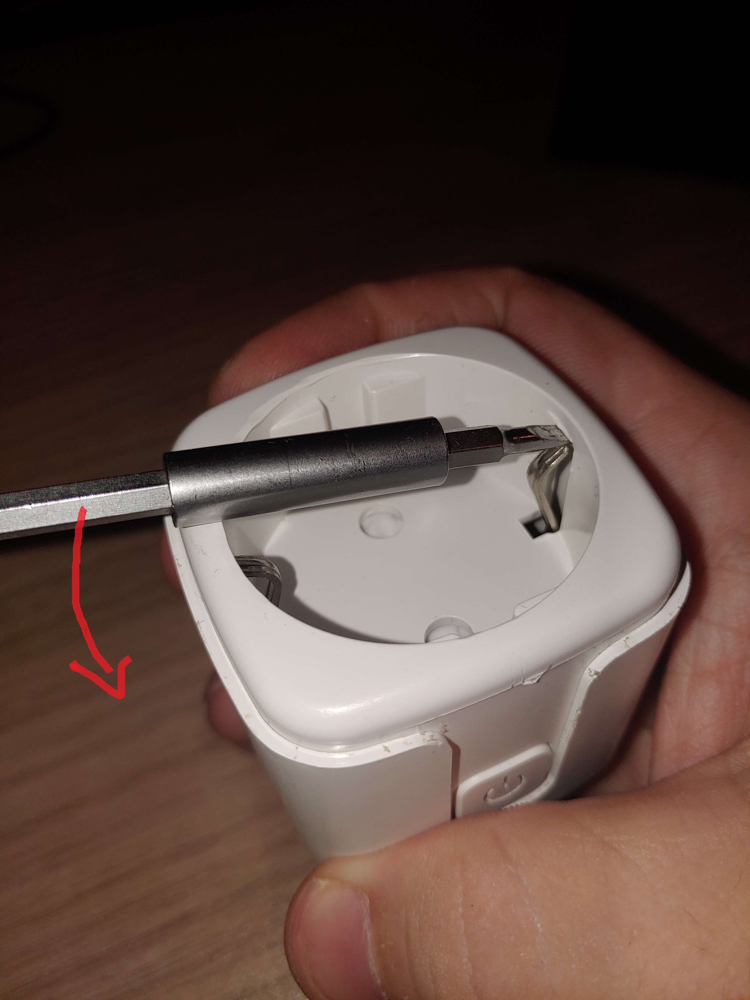
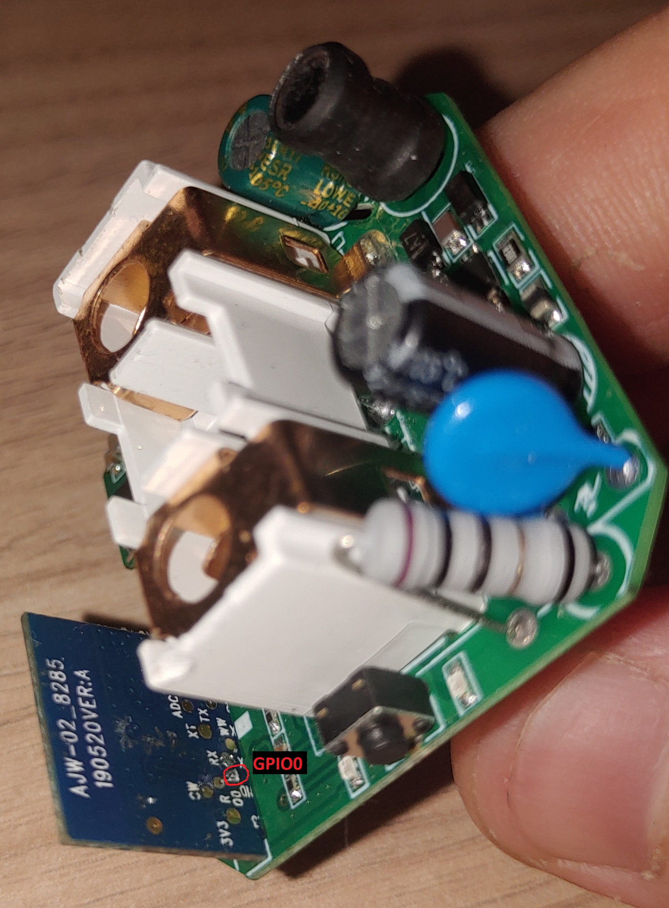
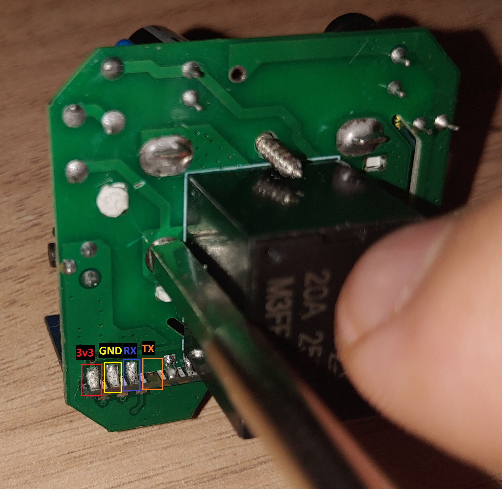

# generic-tuya-power-plug
 Information on generic tuya power plug with monitoring.

 Device: ESP8285
 Device board: AJW-02_8285

 ## Opening the plastic box
 Just insert a precision screwdriver in one of the grounding tabs and pry it by pressing down on the handle


 ## Soldering the wires
Solder a wire to GPIO 0 on the top side of the plug PCB. This one needs to be shorted to GND when powering the device.


Solder 4 additional wires according to the picture below (Please ignore the broken tab on the TX pin :)):


Connect all the wires:

| Smart Plug  | USB-TTL converter |
| ------------- | ------------- |
| GPIO 0  | GND  |
| 3v3  | 3v3  |
| GND  | GND  |
| RX  | TX  |
| TX  | RX  |

Please make sure your USB-TTL converter works on 3.3V

## Install firmware and configure

Install the Tasmota firmware using the tool of your choice. I used https://tasmota.github.io/install/ 

Configuration Template: 

```json
{"NAME":"Generic 20A Power Monitoring Plug","GPIO":[1,1,1,32,2720,224,1,1,1,320,289,1,1,1],"FLAG":0,"BASE":18}
```

